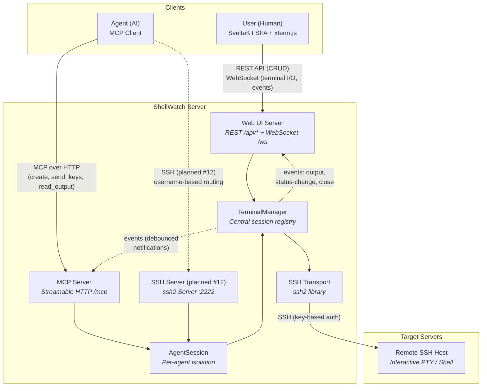
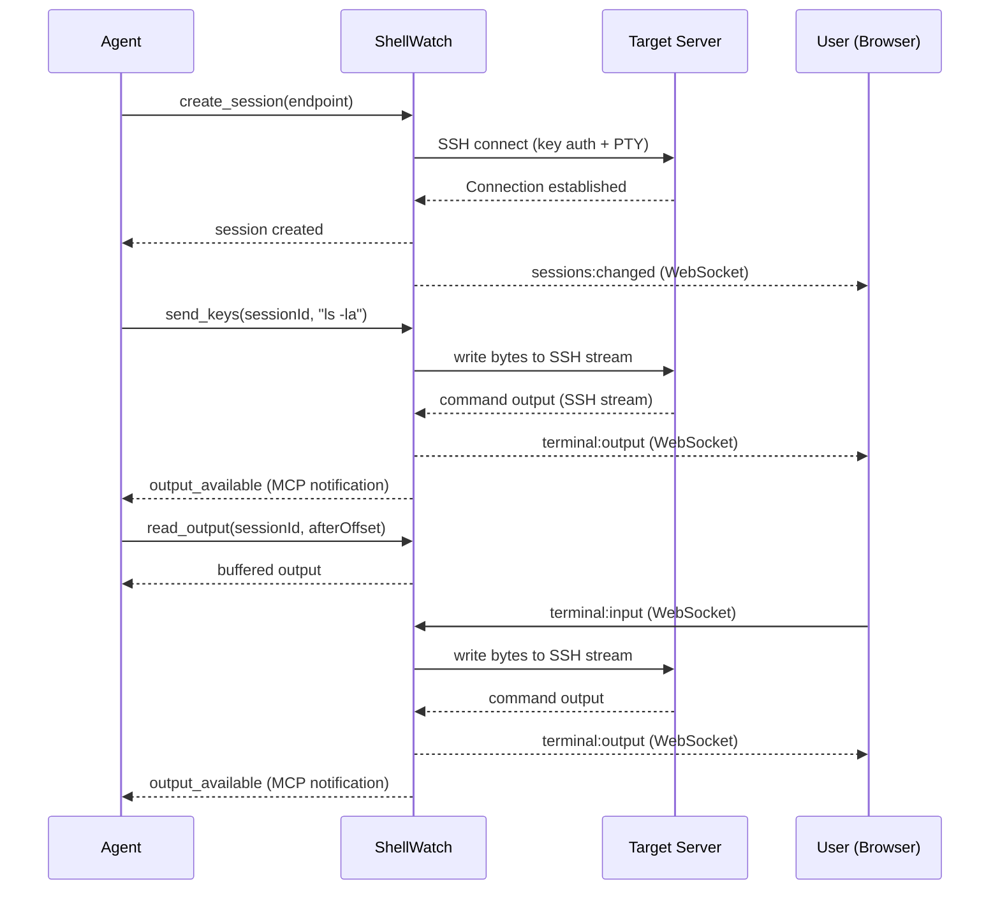

# ShellWatch — Architecture Diagram

High-level functional architecture showing the four primary actors and their interactions.

## Actor Roles

| Actor | Protocol | Access Level | Description |
|-------|----------|-------------|-------------|
| **User** | REST + WebSocket | Admin (all sessions) | Browser-based terminal UI. Sees all sessions regardless of source. Can observe and interact with agent-created sessions in real-time. |
| **Agent** | MCP (HTTP), SSH (planned [#12](https://github.com/user/ShellWatch/issues/12)) | Scoped (own sessions) | AI agent connecting via MCP or SSH. Each agent gets an isolated `AgentSession` and can only see/control sessions it created. |
| **ShellWatch** | &mdash; | &mdash; | Session broker. Routes input/output, buffers terminal data, broadcasts events, enforces isolation between agents. |
| **Target Server** | SSH | &mdash; | Remote host accessed via ssh2 with key-based auth and PTY allocation. |

## Data Flow

