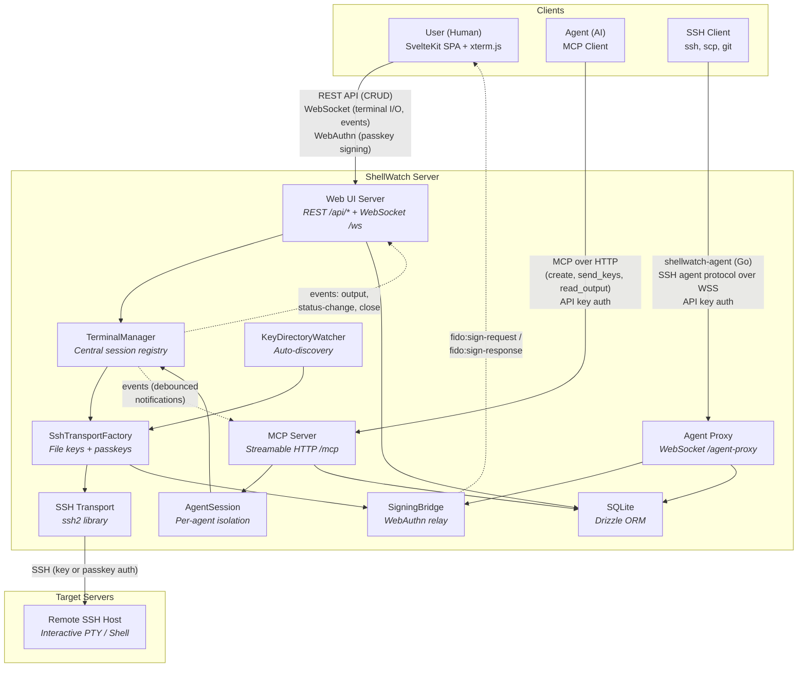
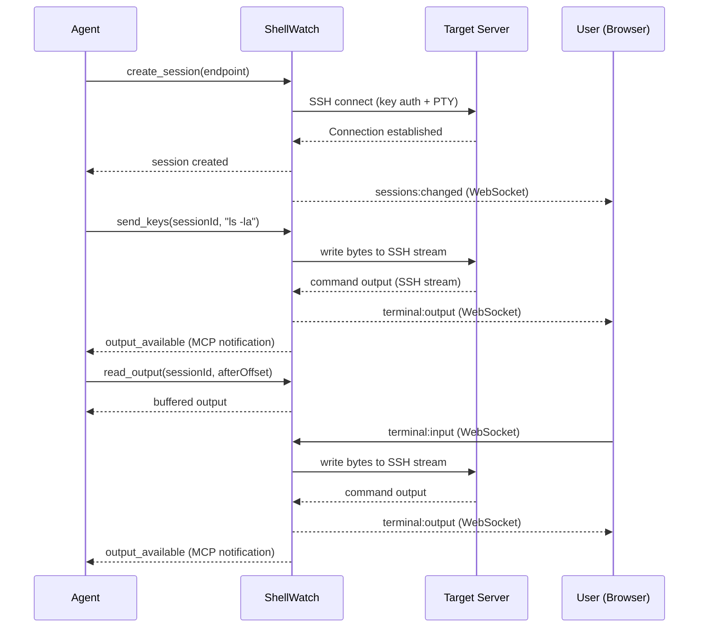
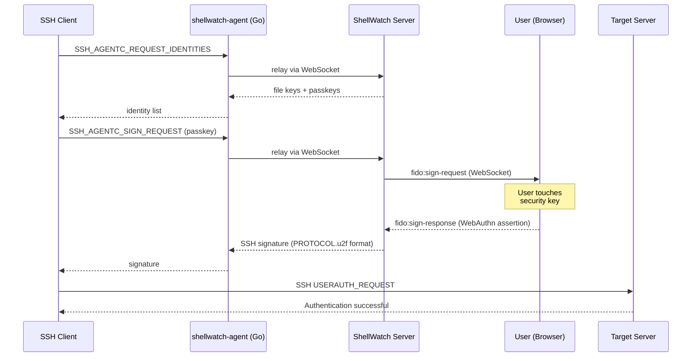

# ShellWatch — Architecture Diagram

High-level functional architecture showing the primary actors and their interactions.

## Actor Roles

| Actor             | Protocol                          | Access Level          | Description                                                                                                                                                                                                            |
| ----------------- | --------------------------------- | --------------------- | ---------------------------------------------------------------------------------------------------------------------------------------------------------------------------------------------------------------------- |
| **User**          | REST + WebSocket + WebAuthn       | Admin (all sessions)  | Browser-based terminal UI. Sees all sessions regardless of source. Handles WebAuthn signing for passkey-based SSH auth.                                                                                                |
| **Agent**         | MCP (HTTP)                        | Scoped (own sessions) | AI agent connecting via MCP. Each agent gets an isolated `AgentSession` and can only see/control sessions it created. Requires API key with `mcp` scope.                                                               |
| **SSH Client**    | SSH agent protocol (via Go proxy) | Key-based             | System SSH clients (`ssh`, `scp`, `git`) using ShellWatch-managed keys via the agent proxy. Supports file keys (auto-sign) and passkeys (browser-signed, requires OpenSSH 10.3+). Requires API key with `agent` scope. |
| **ShellWatch**    | &mdash;                           | &mdash;               | Session broker. Routes input/output, buffers terminal data, broadcasts events, enforces isolation between agents, manages key material and WebAuthn signing.                                                           |
| **Target Server** | SSH                               | &mdash;               | Remote host accessed via ssh2 with key-based or WebAuthn passkey auth and PTY allocation.                                                                                                                              |

## Data Flow — MCP Session

## Data Flow — Agent Proxy with Passkey Signing

